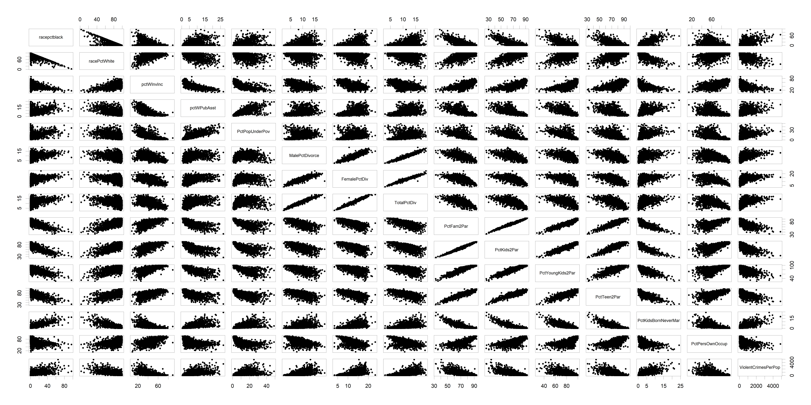

```{r setup, include=FALSE}
knitr::opts_chunk$set(echo = TRUE)
```

```{r, include=FALSE}
# set working directory
# setwd("Project/code")
```

```{r, include=FALSE}
Col = c("#EF476F", "#FFD166", "#06D6A0", "#118AB2", "#073B4C")
Rgb = c(rgb(0.94, 0.28, 0.44, 0.7),
        rgb(1, 0.82, 0.4, 0.7),
        rgb(0.02, 0.84, 0.63, 0.7),
        rgb(0.07, 0.54, 0.7, 0.7),
        rgb(0.03, 0.23, 0.3, 0.7))
```

# Exploratory Data Analysis

```{r}
# import cleaned dataset
cleandf <- read.csv("../data/crimedata-cleaned.csv", row.names = 1)
dim(cleandf)
```


First of all, let us check how many communities are present in the dataset for each state.

```{r, fig.width=16, fig.height=5}
sort(table(cleandf$state))
barplot(table(cleandf$state), las=2, col=Col[5], main = "Number of communities per State")
```

There are states represented by a single community and states with more than 200 observations available.
The data may therefore seem unbalanced, but it must be taken into account that states have different geographical dimensions and each one consists of a different total number of communities.

### Violent Crimes

We begin our exploratory analysis by observing how the rate of violent crimes is distributed on average in the United States, based on the data we have available.

```{r}
# Violent Crimes per 100K Population - State aggregation - Mean
vc_state <- aggregate(cleandf[, "ViolentCrimesPerPop"], list(cleandf$state), mean)
names(vc_state)[names(vc_state) == "Group.1"] <- "state"
names(vc_state)[names(vc_state) == "x"] <- "ViolentCrimesMean"
```

```{r}
summary(vc_state$ViolentCrimesMean)
```

```{r, include=FALSE}
library(ggplot2)
library(usmap)
```

```{r, warning=FALSE, fig.height=2.5, fig.align = "center"}
par(mfrow=c(1,1))
plot_usmap(data = vc_state, values = "ViolentCrimesMean", color = "black") +
   scale_fill_continuous(trans="sqrt", low = Rgb[3], high = Rgb[1],
                         name = "Viol Crimes 100K pop", limits=c(85,3049),
                         label=scales::comma) +
  theme(legend.position = "right")
```

We can notice that the states with the highest average violent crimes rate are mostly located in the southeast. Moreover, the summary and the geographical plot suggest the presence of some outlier in the averages.

```{r, fig.width=16, fig.height=5}
barplot(vc_state$ViolentCrimesMean, names.arg = vc_state$state, las=2, col=Col[1],
        main = "Violent Crimes per 100K population - Average per State")
vc_state[vc_state$ViolentCrimesMean == max(vc_state$ViolentCrimesMean),]
```

It is evident that the value associated to Washington D.C. is much larger than the others.
However, this huge discrepancy may be due to the fact that we are dealing with the capital of the US, then it is interesting to maintain this value in the dataset.


Let us now look to the violent crimes independently.
We recall that the crimes considered to be violent in the United States are murder, rape, robbery and assault.

```{r}
violent_names <- c("murders", "rapes", "robberies", "assaults")
violPerPop_names <- c("murdPerPop", "rapesPerPop", "robbbPerPop", "assaultPerPop")

violent <- cleandf[, (colnames(cleandf) %in% violent_names)]
violPerPop <- cleandf[, (colnames(cleandf) %in% violPerPop_names)]
```

```{r, fig.height=6, fig.width=16}
par(mfrow = c(1,2))
boxplot(violPerPop, outline = TRUE, col = Col[seq(1:4)],
        main = "Violent Crimes per 100K Pop", 
        names = c("murders", "rapes", "robberies", "assaults"))
boxplot(violPerPop, outline = FALSE, col = Col[seq(1:4)],
        main = "Violent Crimes per 100K Pop - Outliers not drawn",
        names = c("murders", "rapes", "robberies", "assaults"))
par(mfrow=c(1,1))
```

From the boxplot it can be noticed that the most frequent violent crime is assault, as expected murders and rapes rapresent a minority.

```{r, include=FALSE}
# install.packages("plotly")
library(plotly)
```

```{r, fig.width=16, fig.height=5, eval=FALSE, include=FALSE}
# Violent Crimes categories per 100K Population - State aggregation - Mean
vc_cat_state <- aggregate(cleandf[, colnames(cleandf) %in% violPerPop_names], list(cleandf$state), mean)
names(vc_cat_state)[names(vc_cat_state) == "Group.1"] <- "state"

plot_ly(data=vc_cat_state, x = ~state, y = ~murdPerPop, type = 'bar', name = 'murders',
        marker = list(color = Rgb[1])) %>%
    add_trace(y = ~rapesPerPop, name = 'rapes', marker = list(color = Rgb[2])) %>%
    add_trace(y = ~robbbPerPop, name = 'robberies', marker = list(color = Rgb[3])) %>%
    add_trace(y = ~assaultPerPop, name = 'assaults', marker = list(color = Rgb[4])) %>%
    layout(xaxis = list(title='State', tickangle = 270), yaxis=list(title = 'Count'), 
           barmode = 'stack')
```


### Non Violent Crimes

As before, we now investigate how the rate of non violent crimes is distributed on average in the United States, based on the data we have available.

```{r}
# Non Violent Crimes per 100K Population - State aggregation - Mean
nvc_state <- aggregate(cleandf[, "nonViolPerPop"], list(cleandf$state), mean)
names(nvc_state)[names(nvc_state) == "Group.1"] <- "state"
names(nvc_state)[names(nvc_state) == "x"] <- "NonViolentCrimesMean"
```

```{r}
summary(nvc_state$NonViolentCrimesMean)
```

```{r, warning=FALSE, fig.height=2.5, fig.align = "center"}
par(mfrow=c(1,1))
plot_usmap(data = nvc_state, values = "NonViolentCrimesMean", color = "black") +
   scale_fill_continuous(trans="sqrt",low = Rgb[3], high = Rgb[1], 
                         name = "Non Violent Crimes", limits=c(2825,9252),
                         label=scales::comma) +
  theme(legend.position = "right")
```

We can see that the south-eastern states have the highest average rates again. However, the crime rate is also very high in other areas. As expected, the non violent crimes are more spread all over the US than the violent ones.

```{r, fig.width=16, fig.height=5}
barplot(nvc_state$NonViolentCrimesMean, names.arg = nvc_state$state, las=2, col=Col[2],
        main = "Non Violent Crimes per 100K population - Average per State")
```

Also in this case, we can notice that the highest average value is associated to the Disctrict of Columbia. This leads us to believe that there may be a particular phenomenon that affects the crime rate or how it is recorded in the capital region. 

The crimes considered as non-violent in the United States are burglaries, larcenies, auto thefts and arsons.

```{r}
nonViol_names <- c("burglaries", "larcenies", "autoTheft", "arsons")
nonViolPerPop_names <- c("burglPerPop", "larcPerPop", "autoTheftPerPop", "arsonsPerPop")

nonViol <- cleandf[, (colnames(cleandf) %in% nonViol_names)]
nonViolPerPop <- cleandf[, (colnames(cleandf) %in% nonViolPerPop_names)]
```

```{r, fig.height = 6, fig.width= 16, fig.align = "center"}
par(mfrow = c(1,2))
boxplot(nonViolPerPop, outline = TRUE, col = Col[seq(1:4)],
        main="Non Violent Crimes Per Pop",
        names = c("burglaries", "larcenies", "auto thefts", "arsons"))
boxplot(nonViolPerPop, outline = FALSE, col = Col[seq(1:4)],
        main="Non Violent Crimes Per Pop",
        names = c("burglaries", "larcenies", "auto thefts", "arsons"))
par(mfrow=c(1,1))
```

Among the non violent crimes, in general the most frequent are larcenies.

```{r, fig.width=16, fig.height=5, eval=FALSE, include=FALSE}
# Non Violent Crimes categories per 100K Population - State aggregation - Mean
nvc_cat_state <- aggregate(cleandf[, colnames(cleandf) %in% nonViolPerPop_names], list(cleandf$state), mean)
names(nvc_cat_state)[names(nvc_cat_state) == "Group.1"] <- "state"

plot_ly(data=nvc_cat_state, x = ~state, y = ~burglPerPop, type = 'bar', name = 'burglaries',
        marker = list(color = Rgb[1])) %>%
    add_trace(y = ~larcPerPop, name = 'larcenies', marker = list(color = Rgb[2])) %>%
    add_trace(y = ~autoTheftPerPop, name = 'auto thefts', marker = list(color = Rgb[3])) %>%
    add_trace(y = ~arsonsPerPop, name = 'arsons', marker = list(color = Rgb[4])) %>%
    layout(xaxis = list(title='State', tickangle = 270), yaxis=list(title = 'Count'),
           barmode = 'stack')
```

### Inspecting variables relation

Let us analyze which variables are more correlated (correlation>0.5) with the variable of violent crimes.

```{r}
coltodrop <- c(1,2, seq(103,118), 120)
viol.corrdf <- cleandf[,-coltodrop]

# correlation matrix
viol.cm <- cor(viol.corrdf, use='complete.obs')

# violent crimes correlation
ViolCrimes.corr <- viol.cm[,dim(viol.cm)[2]]
ViolCrimes.names <- names((ViolCrimes.corr)>0.5)

sort(ViolCrimes.corr[abs(ViolCrimes.corr)>0.5])
```

It seems that the variables more correlated with violent crimes are also correlated with each other. For instance, the attributes PctFam2Par, PctYoungKids2Par, PctKids2Par, PctTeen2Par all refer to the family structure, in particular to the percentage of families (with kids with different age) that are headed by two parents. Probably, also the variables TotalPctDiv, FemalePctDiv and MalePctDiv in addition to being trivially correlated with each other, are correlated with the previous ones.
Moreover, we observe a positive correlation between the percentage of African-American in the population and violent crimes; on the other side, there is a negative correlation with the percentage of Caucasian-American.
In general we can say that the family structure, the marital status, the economic status (pctWInvInc, PctPopUnderPov, PctWPubAsst) and the ethnicity (racepctWhite, racepctblack) are 4 main clusters stricly correlated with Violent Crimes.

Let us investigate if and how these clusters are cross-correlated through a scatterplot.

```{r, eval=FALSE}
pairs(cleandf[,colnames(cleandf)%in% ViolCrimes.names], pch = 20)
```
{#id .class width=100% height=100%}

The plot confirms what already said above: the variables related to the family structure pairly show an evident linear dependence, the same holds for the variables related to the marital status.

Moreover, we can observe that there exists also a relationship between ethnicity and family structure:

* there is a negative correlation between the percentage of African-American and the percentage of families (with kids differently aged) headed by two parents;
* there is a strong positive correlation between the percentage of African-American and the percentage of kids born from never married parents.

In addition, the plot shows a negative correlation between the percentages of Caucasian and African; therefore, all the previuos considerations should be done conversely for the percentage of population that is Caucasian.

This is confirmed by the correlation values shown below:

```{r}
african.corr <- viol.cm[,3]
sort(african.corr[abs(african.corr)>0.5])
```

```{r}
caucasian.corr <- viol.cm[,4]
sort(caucasian.corr[abs(caucasian.corr)>0.5])
```

The above considerations could lead us to think that in general African American families have a more fragile structure that could be a risk factor for the exposure of young people to illegality and violence, or, on the other hand, they could highlight the presence of the well known, but always tricky, confounding effect, about which we'll go into details further.
Along with that, another fundamental factor has to be considered: a pretty famous social phenomenon, known as the *crack epidemic*, took place in the USA during the past 80s and 90s, period in which our data have been gathered. Shortly speaking, faced with dropping prices of cocaine powder, drug dealers made a decision to convert it to "crack", a solid smokeable form of cocaine, that could be sold in smaller quantities, to more people. It was cheap, simple to produce, ready to use, and highly profitable for dealers to develop, which made the new product spread rapidly and made the homicide rate for young black males more than doubled, due to the fact that the distribution of the drug to the end-user occurred mainly in low-income inner city neighborhoods: this gave many inner-city residents the opportunity to move up the "economic ladder" in a drug market, at the cost of violence to establish territorial control. Moreover, this habits caused a long term effect in the society, estending the phenomenon over its actual time period[2,3,4,5].

We carry now the same analysis in order to understand which variables are more correlated (correlation>0.5) with the variable of non violent crimes.

```{r}
coltodrop <- c(1,2, seq(103,119))
nonViol.corrdf <- cleandf[,-coltodrop]

# correlation matrix
nonViol.cm <- cor(nonViol.corrdf, use='complete.obs')

# violent crimes correlation
nonViol.corr <- nonViol.cm[,dim(nonViol.cm)[2]]

sort(nonViol.corr[abs(nonViol.corr)>0.5])
```

We can observe that the most correlated variables are still those related to the family structure, the marital status and poverty.

```{r, include=FALSE}
# remove no more useful variables
rm(list=setdiff(ls(), c("cleandf","crimedata","standf", "Col", "Rgb")))
```


\newpage

# References

[1] "An Introduction to Statistical Learning", G. James, D. Witten, T. Hastie and R. Tibshirani, Springer, 2013.

[2] "DEA History Book, 1876–1990" (drug usage & enforcement), US Department of Justice, 1991, USDoJ.gov, webpage: DoJ-DEA-History-1985-1990.

[3] "Guns and Violence: The Enduring Impact of Crack Cocaine Markets on Young Black Males", W.N. Evans, G. Garthwaite, T. Moore, 2018.

[4] "Measuring Crack Cocaine and Its Impact", Fryer, Roland. Harvard University Society of Fellows: 3, 66. Retrieved January 4, 2016.

[5] "The New Jim Crow: Mass Incarceration in the Age of Colorblindness", M. Alexander.

[6] http://www.disastercenter.com/crime/uscrime.htm

[7] https://archive.ics.uci.edu/ml/datasets/Communities+and+Crime+Unnormalized

[8] https://online.stat.psu.edu/stat462/node/171/.

[9] https://peltarion.com/knowledge-center/documentation/modeling-view/build-an-ai-model/loss-functions/mean-squared-logarithmic-error-(msle)

[10] https://towardsdatascience.com/the-mathematics-behind-principal-component-analysis-fff2d7f4b643
